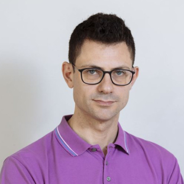

The concept of performance in EPEW 2024 is considered in its broadest sense including the notions of Quality of Service, scalability as well as reliability, availability and systems management, among the others. Therefore, of particular interest are the ideas introducing new methods for evaluating complex systems, as well as innovative applications of methodologies and known techniques to the latest generation of systems, networks and computer-based services. 

EPEW 2024 seeks papers based on performance evaluation of systems from theoretical and practical viewpoint. Application of performance evaluation techniques to emerging technologies, like cyber-physical systems ranging from mobile devices and Internet-of-Things (IoT), fog and edge computing, applications to large-scale cloud computing systems, smart grids, security infrastructures, are among the topics of interest to EPEW 2024.

##### Post-Proceedings

The workshop is featuring post-proceedings this year, so we have a two-phase review process.
We sollicit short papers of at most 7 pages for presentation at the conference, which will not be published.
Authors of accepted short papers are then invited to submit a full paper with at most 15 pages for publication in the post-proceedings, which we plan to publish with  Springer as LNCS volume.

## Transportation

You can find details on the private transoportation to reach the San Servolo <a href="https://www.sigmetrics.org/sigmetrics2024/transportation.html">here</a>.
If you want to use the public transportation of the municipality you can use the line 20, <a href="https://servizimetropolitani.ve.it/images/orari-vaporetti-venezia/orari_linea_20.pdf">here the timetable</a>.

                                                                                                                                                                    

# Program

|Time   UTC+2 |Paper Title                                                                                    |
|-------|---------------------------------------------------------------------------------------------------------|
|09:15 AM  | Opening Remarks|
|09:15 AM - 10:45 AM | _Session 1 -- Chair: Daniele Di Pompeo_ |
|09:25 AM  | **Sender and Receiver Energy Consumption in a Sensor Network**   Jean-Michel Fourneau and Franck Quessette |
|09:45 AM  | **Design and Analysis of Distributed Message Ordering over a Unidirectional Logical Ring**   Ye Liu, Paul Ezhilchelvan and Isi Mitrani               |
|10:05 AM  | **Analytical Modelling of Asymmetric Multi-core Servers**   Marco Gribaudo and Tuan Phung-Duc        |
|10:25 AM  | **Under the space threat: Quantitative Analysis of Cosmos blockchain**   Daria Smuseva, Ivan Malakhov, Andrea Marin, Carla Piazza and Sabina Rossi |
|10:45 AM  | **COFFEE BREAK**                                                                                 |
|11:15 AM - 01:15 PM | _Session 2 -- Chair: Marco Scarpa_ |
|11:15 AM  | **A Tool for Efficient Derivation of Optimal Signal Schedules for Multimodal Intersections**   Nicola Bertocci, Laura Carnevali, Leonardo Scommegna and Enrico Vicario             |
|11:35 AM  | **Performance Evaluation of Beaconing Schemes for Vehicular Platooning**    Hassan Laghbi and Nigel Thomas  |
|11:55 AM  | **Approximation of First Passage Distributions in Markov Chains with Replicated Components**   András Horváth, Marco Paolieri and Enrico Vicario  |
|12:15 PM  | **A Lumped CTMC for Modular Rewritable PN**   Lorenzo Capra and Marco Gribaudo. |   
|12:35 PM  | **How to Rent GPUs on a Budget**   Zhouzi Li, Benjamin Berg, Arpan Mukhopadhyay and Mor Harchol-Balter     |
|01:15 PM  | **LUNCH**                                                                                  | 
|02:45 PM - 04:15 PM | _Session 3 -- Chair: Josu Doncel_ |
|02:45 PM  | **Keynote**: [Software Performance Modeling for the Cloud: An Overview](keynote) Mirco Tribastone                                                                                      |
|03:45 PM  | **Robust Streaming Benchmark Design in the Presence of Backpressure**   Iain Dixon, Matthew Forshaw and Joe Matthews                   |
|04:15 PM  | **COFFEE BREAK**                                                                                 |
|04:30 PM - 05:30 PM | _Session 4 -- Chair: Jean-Michel Fourneau_ |
|04:30 PM  | **Evaluating No-Wait Approach for resolving conflicts in database**   Yingming Wang, Paul Ezhilchelvan, Jack Waudby and Jim Webber  |
|04:50 PM  | **Whom are you voting for? An evaluation based on Markovian agents**   Marco Scarpa, Marco Garofalo, Francesco Longo and Salvatore Serrano  |
|05:10 PM  | **Performance Evaluation of Smart Bin Systems Using Markovian Agents for Efficient Garbage Collection**   Enrico Barbierato, Alice Gatti, Marco Gribaudo and Mauro Iacono  |
|05:30 PM  | **Closing**                                                                                              |

## Keynote

__Mirco Tribastone__

 

__Title__

Software Performance Modeling for the Cloud: An Overview

__Abstract__

Through an array of service models such as SaaS, PaaS, and IaaS, cloud computing has become an indispensable part of modern business operations, offering a wide range of benefits driving its rapid adoption, including versatility, scalability, and security. However, cost optimization still remains a difficult challenge specifically for right-sizing, i.e., choosing the instance configurations that best suit the workload. In this talk, I will overview past and current efforts to address this issue using software performance modeling and optimization, including recent initiatives at applying research results into industry.

__Bio__

Mirco is Full Professor of Computer Science at IMT Lucca, where he leads the [SySMA research unit](https://sysma.imtlucca.it/) and also serves as Deputy Rector and Rector's Delegate for Education and Information Systems.

He is co-founder of Valuematic, an IMT spin-off company which recently received seed funding for the development of new technologies for sustainable cloud computing.

Prior to joining IMT, Mirco was Associate Professor at the School of Electronics and Computer Science of Southampton University, United Kingdom, and Assistant Professor (Juniorprofessur) at the Institute for Informatics of the Ludwig-Maximilians University of Munich, Germany. He received my Ph.D. in Computer Science from the School of Informatics of the University of Edinburgh, Scotland, in 2010.

## Call for paper

Topics of interest include but are not limited to the following topic areas:

Theoretical advances in performance modeling and evaluation:

  - Probabilistic, stochastic, or performability models, such as Queueing Networks, Petri Nets, and Process Calculi;
  - Specification of quantitative properties,
  - Analytical and numerical solution techniques and simulation techniques,
  - Quantitative model checking, equivalence checking, and static analysis
  - Context-aware modelling and analysis techniques
  - Machine learning and deep learning-based approaches for performance evaluation and analysis
  - Multiformalism and Multiparadigm modelling approaches

 

System, software, and network performance engineering:

  - Performance-oriented design, architecture, implementation, deployment, monitoring, and maintenance
  - Constraint-based and model-driven system design
  - Performance analysis, simulation, and experimental design
  - Benchmark design and benchmark-based evaluation and monitoring
  - Automated interpretation of analysis results
  - Quality of service, and trade-offs between security, performance, dependability, energy consumption, usability, etc.
  - Software performance modeling languages, model composition and tool interoperability
  - 6G and beyond

Case studies:

  - Cloud systems, Hybrid Cloud, and Fog Computing Internet of Things
  - Cyber-physical systems
  - E-health systems
  - Blockchain and Cryptocurrency applications
  - Sharing services such as carshare and rideshare
  - Electric vehicles and battery modelling
  - Large-scale systems and scalability analysis of systems, robustness analysis of systems, resilience analysis of systems
  - Industrial case studies, experience reports and tools, with a solid analysis and theoretical background

##### Submission

EPEW 2024 seeks __workshop presentations__, submitted in the form of 7 pages _short research papers_ in LNCS format. 

Authors of accepted short papers will be invited to submit an extend version of the short paper for publication in the __post-proceedings__.

The page limit of an article in the post-proceedings is 15 pages in LNCS format.

All page limits include tables, figures, and references.

All submitted papers will be reviewed on the basis of technical quality, relevance, significance, and clarity by the program committee. 
All papers should be submitted electronically in PDF format through the [EasyChair workshop website](https://easychair.org/my/conference?conf=epew2024).
Submissions must follow the LNCS proceedings format.

## Organizing Committee

__General Chair__

 * Josu Doncel, University of the Basque Country, Spain

__TPC Chairs__
 
 * Anne Remke, University of Münster, Germany
 * Daniele Di Pompeo, SPENCER Lab, University of L'Aquila, Italy

## Program Committee

 * Salvador, Alcaraz, Miguel Hernandez University                                      
 * Elvio Gilberto, Amparore, University of Turin
 * Paolo, Ballarini, CentraleSupelec
 * Marco, Bernardo, University of Urbino
 * Laura, Carnevali, Dept. of Information Engineering - University of Florence
 * Davide, Cerotti, Università del Piemonte Orientale
 * Carina, Da Silva, University of Münster
 * Dieter, Fiems, Ghent University
 * Matthew, Forshaw, Newcastle University
 * Jean-Michel, Fourneau, DAVID, Universite de Versailles St Quentin
 * Pedro Pablo, Garrido Abenza, Miguel Hernandez University
 * Antonio, Gomez, Complutense University of Madrid
 * Marco, Gribaudo, Politecnico di Milano
 * Nikolas, Herbst, University of Würzburg
 * András, Horváth, University of Turin
 * Alain, Jean-Marie, INRIA
 * Carlos, Juiz, University of the Balearic Islands
 * Lasse, Leskelä, Aalto University
 * Francesco, Longo, University of Messina
 * Marco, Paolieri, University of Southern California
 * Nihal, Pekergin N., Univ. Paris-Est-Creteil
 * Tuan, Phung-Duc, University of Tsukuba
 * Agapios, Platis, University of the Aegean
 * Marco, Scarpa, University of Messina
 * Markus, Siegle, Uni Bw Munich
 * Nigel, Thomas, University of Newcastle
 * Catia, Trubiani, Gran Sasso Science Institute
 * Joris, Walraevens, Ghent University - UGent

## Important dates
(All deadlines are 23:59, Anywhere on Earth)

 * Deadline for submissions (short paper): ~~7th April~~  ~~21st April~~ __26th April (12:00 CEST)__
 * Acceptance notification:  10th May
 * Deadline for post-proceedings: 31st July
 * Acceptance notification of post-proceedings: 30th September

## Contact
For any questions, please don’t hesitate to contact us at: [epew2024@easychair.org](epew2024@easychair.org)

